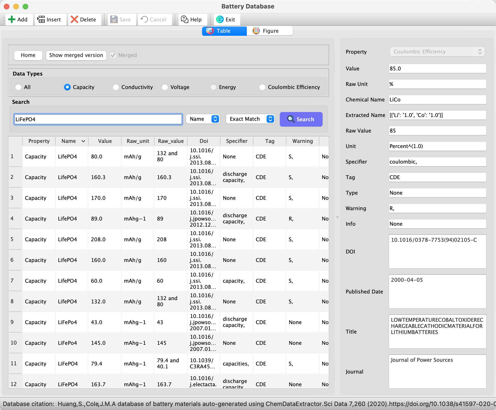
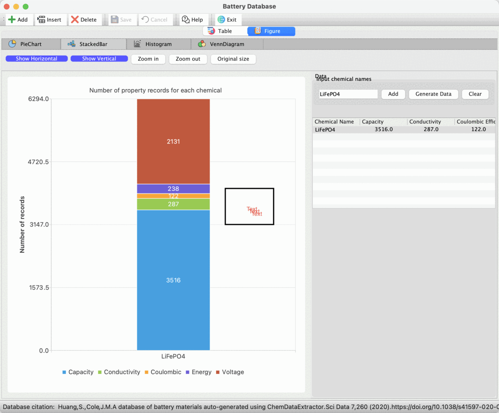

# BatteryGUI

[](https://github.com/shuhuang/batterygui/blob/master/LICENSE)

This is a GUI for the visualisation of the battery database based on PyQt5.

## Installation

To use the BatteryGUI, firstly create a virtual environment: 
```
python -m venv batterygui
```

Activate the virtual environment and install the required packages: 
```
pip install -r requirements.txt
```

Run: 
```
python appMain.py
```

**Create the executable(.exe) file and installer**

We suggest using fbs (fmans build system) to build a stand-alone executable for this GUI application. More details in this [website](https://build-system.fman.io/pyqt-exe-creation/).

## Example Usage
**Table View**
<p>
    
</p>

**Figure View**

<p>
    
</p>

## Acknowledgements
This project was financially supported by the [Science and Technology Facilities Council (STFC)](https://www.ukri.org/councils/stfc/), the [Royal Academy of Engineering](https://raeng.org.uk/) (RCSRF1819\7\10) and [Christ's College, Cambridge](https://www.christs.cam.ac.uk/). The Argonne Leadership Computing Facility, which is a [DOE Office of Science Facility](https://science.osti.gov/), is also acknowledged for use of its research resources, under contract No. DEAC02-06CH11357.

## Citation
```
@article{huang2020database,
  title={A database of battery materials auto-generated using ChemDataExtractor},
  author={Huang, Shu and Cole, Jacqueline M},
  journal={Scientific Data},
  volume={7},
  number={1},
  pages={1--13},
  year={2020},
  publisher={Nature Publishing Group}
}
```
[](https://doi.org/10.1038/s41597-020-00602-2)

